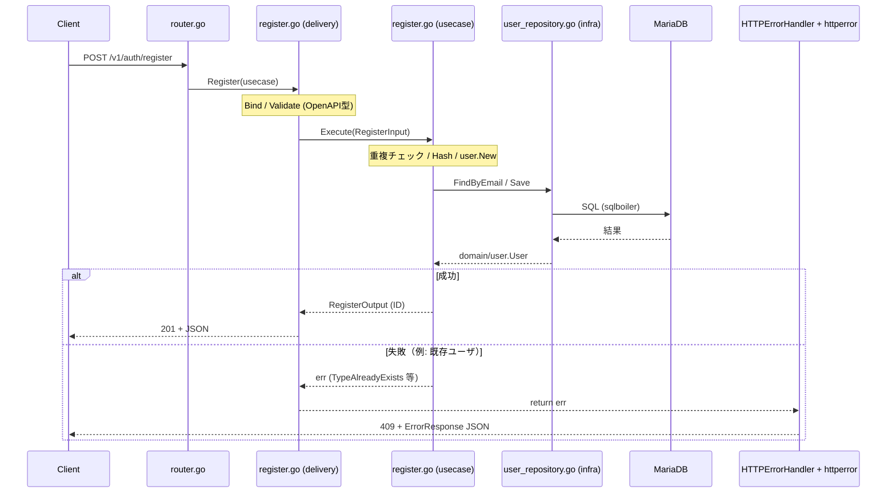

# 5 分で追う Register の道順

MVC 経験がある方向けに、**ユーザ登録（`POST /v1/auth/register`）** だけをたどるガイドです。  
クリーンアーキテクチャの用語は最小限にし、「どのファイルに何を書くか」が分かれば十分です。

## このリポジトリの置き換え表（MVC との対応）

| よくある MVC | このリポジトリ | Register で見るファイル |
|--------------|----------------|-------------------------|
| Controller | **delivery**（HTTP） | `internal/delivery/restapi/v1/auth/register.go` |
| Service | **usecase**（書き込みの手順） | `internal/app/usecase/auth/register.go` |
| Model（DB 都合の型） | **infra** の sqlboiler モデル | `internal/infra/mariadb/models/`（触らない） |
| ドメインのデータ＋ルール | **domain** | `internal/domain/user/user.go` |
| Repository  interface | **domain** のポート | `internal/domain/user/repository.go` |
| Repository  実装 | **infra** | `internal/infra/mariadb/user_repository.go` |
| DI・組み立て | **registry** | `internal/registry/registry.go` |

**覚えるのは 3 行で十分です。**

1. HTTP は **delivery だけ**
2. 手順（ビジネス）は **usecase の `Execute`**
3. DB は **infra**（usecase は `user.Repository` インターフェースだけ見る）

---

## リクエストの流れ（全体図）



起動時に `registry.New` で usecase に **ログ・バリデーション・トランザクション** が自動で巻かれます（後述）。  
アプリを書くときは **Handler → Usecase → Repository** だけ意識すれば大丈夫です。  
エラー時の JSON は **ハンドラでは書かず**、`engine.HTTPErrorHandler` が `httperror.Encode` で返します。

---

## 道順 1：ルート（どの Handler が呼ばれるか）

**ファイル:** `internal/delivery/restapi/router.go`

- `POST /v1/auth/register` → `auth.Register(reg.UsecaseSet.AuthRegister)`
- `AuthRegister` は `registry.New` で組み立て済みの usecase が入っている

---

## 道順 2：HTTP（JSON ↔ ステータスコード）

**ファイル:** `internal/delivery/restapi/v1/auth/register.go`

やることは次の 4 つだけです。

| 順番 | 処理 |
|------|------|
| 1 | OpenAPI 型 `RegisterRequest` に Bind |
| 2 | Echo の Validate（形式チェック） |
| 3 | `service.Execute(ctx, &RegisterInput{...})` を呼ぶ |
| 4 | 成功時は `c.JSON(201, …)`。エラー時は **`return err` のみ**（409 等の JSON は `httperror` + `HTTPErrorHandler`） |

**書かないこと:** SQL、トランザクション、パスワードハッシュのロジック、重複チェックの判断、**ハンドラ内での `httperror.Encode`（エラー JSON の組み立て）**。

エラー応答のマッピング実装: `internal/delivery/restapi/httperror/encoder.go`（`engine.go` の `HTTPErrorHandler` から呼ばれる）。

`RegisterInput` は usecase 専用の型です。OpenAPI の `RegisterRequest` とフィールドを合わせて渡すだけ、と考えてください。

---

## 道順 3：ユースケース（ビジネスの手順）

**ファイル:** `internal/app/usecase/auth/register.go` の `Execute`

おおまかな流れ:

```
1. userRepo.FindByEmail(email)
2. 既にいれば TypeAlreadyExists エラー
3. hasher.Hash(平文パスワード)
4. user.New(name, email, hash) でドメインの User を作る
5. userRepo.Save(ctx, entity) → 新しい ID
6. RegisterOutput{ID} を返す
```

**書く場所:** 「登録済みか」「どういう順で保存するか」などの**手順**。  
**書かない場所:** HTTP ステータス、JSON タグ、sqlboiler の型。

テスト例: `internal/app/usecase/auth/register_test.go`（Repository を mock して `Execute` だけ検証）。

---

## 道順 4：ドメイン（アプリの User とは）

**ファイル:**

- `internal/domain/user/user.go` — `User` 本体（フィールドは非公開 + getter）
- `internal/domain/user/repository.go` — `FindByEmail` / `Save` の interface

新規作成は **`user.New(...)`** だけ使います（フィールドへの直接代入はしない）。  
DB から読み直すときは **`user.Reconstruct(...)`** です。

---

## 道順 5：DB 実装（infra）

**ファイル:** `internal/infra/mariadb/user_repository.go`

- `domain/user.Repository` を実装している
- 中では sqlboiler の `models.User` を使う
- `FindByEmail` → `user.Reconstruct` で domain に戻す
- `Save` → domain から `models.User` に詰め替えて Insert / Update

**sqlboiler の生成コード**（`internal/infra/mariadb/models/*.go`）は **手編集しない**。  
スキーマ変更時は `make generate.boilerplate`（詳細は `migrations/README.md`）。

---

## 道順 6（おまけ）：起動時の組み立て

**ファイル:** `internal/registry/registry.go`

Register 用の usecase は次のように作られます。

```go
authRegisterUsecase := applyStandardWithRequiredTx("auth-register",
    authuc.NewRegisterUsecase(userRepo, bcryptHasher),
    deps,
)
```

意味:

| 処理 | 内容 |
|------|------|
| `NewRegisterUsecase` | 素の usecase（上の道順 3） |
| `applyStandardWithRequiredTx` | ログ → バリデーション → **DB トランザクション** → usecase |

**新機能を書くとき**に毎回触るのは主に `registry.go` のこのブロックです。  
`wire.go` の `applyStandard*` は横断関心のテンプレートとして理解しておけば十分です。

---

## 仕様変更するときの「触るファイル」早見表

| 変更内容 | 触るファイル |
|----------|----------------|
| API の JSON 項目を増やす | `api/openapi/openapi.yaml` → 生成 → `delivery/.../register.go` + `usecase/.../register.go` の Input |
| 登録ルールを変える（重複条件など） | `usecase/auth/register.go` + `register_test.go` |
| DB カラムを増やす | `migrations/schema.sql` + `schema.sql.boiler` → sqlboiler 再生成 → `user_repository.go` |
| 成功時の HTTP コード（例: 201） | `delivery/.../register.go` の `c.JSON` |
| エラー時の HTTP コード（例: 409） | `httperror/encoder.go`（`domain/errors` → ステータス） |

---

## よくある質問

### Q. usecase と query の違いは？

| | usecase | query |
|--|---------|-------|
| 用途 | 登録・更新・削除など **状態を変える** | 検索・参照など **読むだけ** |
| Register | usecase 側 | — |

### Q. 詰め替えはなぜあるの？

- delivery: OpenAPI の型（API 契約）
- usecase: アプリの Input/Output
- domain: ビジネスの User
- infra: DB の models.User

型の名前は似ていても **変更の理由が違う**ので分けています。  
最初は「Handler で受け取った値を Input に渡す」「Repository が domain を返す」程度で十分です。

### Q. もっと詳しく知りたい

- 機能追加の手順: [`CONTRIBUTING.md`](../CONTRIBUTING.md)
- アーキのルール: [`.cursor/rules/go-clean-architecture.mdc`](../.cursor/rules/go-clean-architecture.mdc)
- テストの書き方: [`.cursor/rules/testing.mdc`](../.cursor/rules/testing.mdc)

---

## 5 分チェックリスト

読み終わったら、自分で次を辿れるか確認してください。

- [ ] `router.go` から `register.go`（delivery）に到達できる
- [ ] delivery が `RegisterInput` を作って `Execute` している
- [ ] usecase が `user.Repository` だけを使っている（sqlboiler を import していない）
- [ ] `user.New` で User を作っている
- [ ] `user_repository.go` が domain ↔ DB を変換している
- [ ] `registry.go` で Register usecase が登録されている
- [ ] エラー時は handler が `return err` し、JSON は `httperror` + `HTTPErrorHandler` が返す
